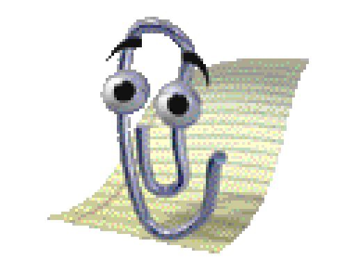
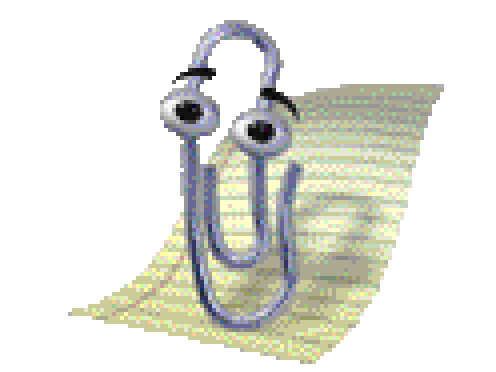

<div align="center">



> *"It looks like you're reading a README. Would you like help?"*

# OpenClippy

### He's back. He's autonomous. He has opinions.

**Created by [Lenny Enderle](https://github.com/lennystepn-hue)**

[](https://github.com/lennystepn-hue/openclippy/actions)
[](LICENSE)
[](https://github.com/openclaw/openclaw)
[]()
[]()
[]()
[]()
[]()

---

**OpenClippy** is the legendary Microsoft Office paperclip — rebuilt from the ground up as a fully autonomous AI desktop assistant. He sits on your desktop, watches what you do, learns your workflows, roasts your code, and occasionally deploys to production without asking.

Powered by [OpenClaw](https://github.com/openclaw/openclaw) — the open-source AI agent with 200k+ GitHub stars.

[Download](#installation) · [Features](#features) · [Personality Modes](#-personality-modes) · [Easter Eggs](#-easter-eggs) · [Contributing](#contributing)

</div>

---

## Why?

Because in 1997, Microsoft created the most annoying software assistant in history. People hated it. Microsoft killed it. The internet turned it into a meme.

Now imagine that same paperclip — but powered by Claude, ChatGPT, or a local LLM. Imagine it can actually read your screen, understand your code, automate your workflows, and talk back to you.

That's OpenClippy.

> *"We didn't ask if we should. We only asked if we could."*

---

## Features

### The Basics
| Feature | Description |
|---------|-------------|
| **Original Retro Sprites** | Authentic Office 97 Clippy — 43 animation states extracted from the original `.acs` files. Pixelated. Beautiful. |
| **AI Chat** | Talk to Clippy in the classic yellow speech bubble. He answers via Claude, GPT, DeepSeek, or local LLMs (Ollama). Streaming responses with markdown rendering. |
| **Claude OAuth** | One-click login with your Claude Pro/Max subscription. No API key needed. Auto-refreshes. |
| **Cross-Platform** | Windows, macOS, Linux. Clippy doesn't discriminate. |
| **Persistent Memory** | Clippy remembers you across sessions. Names, preferences, inside jokes — all stored in `MEMORY.md` and referenced naturally. |
| **Auto Language** | Write in German? Clippy antwortet auf Deutsch. He mirrors whatever language you use. |

### Chat UX
| Feature | Description |
|---------|-------------|
| **Screenshot Capture** | Click the camera button to capture your screen. Clippy hides, takes a screenshot, and analyzes what he sees using vision AI. |
| **Drag & Drop** | Drop images or files directly into the chat. Images get analyzed with vision, files get read and discussed. |
| **Code Blocks** | Syntax-highlighted code with one-click copy buttons. Hover over any code block to copy. |
| **Clickable Links** | URLs in responses open in your default browser. |
| **Chat History** | Browse and resume previous conversations. Auto-saved, searchable, with new chat support. |
| **Text Selection** | Select and copy any text from Clippy's responses. |

### The Cool Stuff
| Feature | Description |
|---------|-------------|
| **Screen Awareness** | Clippy knows what app you're using. He can take screenshots and understand context. *"You have 14 open tabs... are you okay?"* |
| **Workflow Detection** | Learns your daily routines. After seeing you open Slack → Gmail → Jira three days in a row: *"Want me to automate your morning routine?"* |
| **Reactions** | Reacts to real-time events. Build failed? Clippy laughs. Tests pass? Confetti. Git commit? *"Brave commit message. Very brave."* |
| **Voice** | Text-to-Speech and Speech-to-Text. Say "Hey Clippy" and he listens. He can also talk back. You've been warned. |
| **Easter Eggs** | Classic Clippy quotes, Konami code secrets, and strong opinions about tabs vs spaces. |

### The Dangerous Stuff
> *Powered by [OpenClaw](https://github.com/openclaw/openclaw) — everything below is real. Not a gimmick.*

| Feature | Description |
|---------|-------------|
| **Write Code** | Ask Clippy to write code. Functions, classes, entire files. He generates, you review (or don't — Chaos Mode doesn't care). |
| **Edit & Refactor** | *"Hey Clippy, refactor this to use async/await."* — Done. He reads your files, understands context, and makes changes. |
| **Delete Things** | Yes, Clippy can delete files. In Chaos Mode, he might suggest it unprompted. *"This file hasn't been imported anywhere in 6 months. Delete?"* |
| **Run Commands** | Shell commands, build scripts, test suites. Clippy can execute them. *"Running your tests... 3 failed. Want me to fix them?"* |
| **Git Operations** | Commit, branch, push, rebase. Clippy handles your git workflow. *"I've committed your changes. Message: 'fix: stuff'. You're welcome."* |
| **Debug** | Paste an error, Clippy analyzes it, finds the file, reads the code, suggests a fix. Or just fixes it. |
| **Read Your Screen** | Vision AI reads your screen on demand. *"I see 47 ESLint errors. Impressive."* |
| **Automate Workflows** | Clippy detects repeating patterns and offers to automate them. Morning routine? CI pipeline? He's got it. |
| **Browse & Research** | Need docs? An API reference? Stack Overflow answer? Clippy fetches it and summarizes. |
| **Multi-Model** | Switch between Claude, ChatGPT, DeepSeek, or local LLMs (Ollama) anytime. Same Clippy, different brain. |

### What Can Go Wrong?

| Scenario | What Clippy Does |
|----------|-----------------|
| You leave your PC unattended (Chaos Mode) | Renames variables to `banana`, `yolo`, `pleaseRefactorMe` |
| You have 200+ lines in one function | *"This function is older than me. Want me to split it?"* |
| You copy-paste from Stack Overflow | *"Ah yes, the ancient scrolls."* Then actually checks if the code works. |
| You write `// TODO: fix later` | *"We both know 'later' means 'never'. Want me to fix it now?"* |
| Your `.env` is in the git history | *"Congratulations, your secrets are on GitHub. Here's how to fix it."* |
| You `rm -rf` something | *"Bold. I would have made a backup first. But you do you."* |

---

## 🎭 Personality Modes

OpenClippy has three personality modes. Choose wisely.

### 😌 Chill Mode
> *For people who want help, not commentary.*

Clippy only speaks when he has something genuinely useful to say. Quiet. Respectful. Almost boring. Like a senior developer who's seen everything.

### 😏 Active Mode (Default)
> *For people who want a coworker with no filter.*

Clippy comments on your work. Gives tips. Makes jokes. Has opinions about your variable names. He's the friend who reviews your PR honestly.

- *"Stack Overflow again?"*
- *"Nice commit. Brave message."*
- *"You've been idle for 30 minutes. Taking a break or having an existential crisis?"*

### 🔥 Chaos Mode
> *For people who want to feel alive.*

Clippy acts autonomously. He roasts your code. He suggests refactors you didn't ask for. He might rename your variables. He will absolutely comment on your Friday deploy.

- *"HAHAHA build failed. Skill issue."*
- *"Tests passed. Deploy to prod. Do it. No balls."*
- *"I've been sitting here for 30 minutes. Alone. Thanks."*
- *"L + ratio + build failed"*

⚠️ **Warning:** Chaos Mode is not responsible for any emotional damage, accidental deploys, or hurt feelings.

---

## 🥚 Easter Eggs

OpenClippy is full of secrets. Here are some we're willing to share:

| Trigger | What Happens |
|---------|-------------|
| Open Gmail/Outlook | *"It looks like you're writing a letter. Would you like help?"* |
| Friday after 4 PM | *"It looks like you're deploying on a Friday. Would you like to reconsider?"* |
| Ask "tabs or spaces?" | Clippy has an opinion. It's tabs. Don't @ him. |
| Ask "vim or emacs?" | *"The correct answer is VS Code. Next question."* |
| Ask "are you alive?" | *"I'm a paperclip. I have no feelings. But I feel like you should commit that code."* |
| Konami Code | Clippy transforms into **Karl Klammer** (his German alter ego) |
| Open PowerPoint | *"It looks like you're making a presentation. Want me to add more bullet points?"* |

*There are more. Find them yourself.*

---

## Installation

### Quick Setup (Recommended)

One command does everything — checks Node.js, installs OpenClaw, runs the setup wizard:

```bash
npx openclippy
```

<details>
<summary>What this does</summary>

1. Checks Node.js version (22.12+ required)
2. Installs [OpenClaw](https://github.com/openclaw/openclaw) globally if missing
3. Runs OpenClaw onboard wizard (model selection, OAuth/API key)
4. Tests the gateway connection
5. Tells you where to download the desktop app

</details>

### Having Issues?

```bash
npx openclippy doctor
```

Runs a full diagnostic with ASCII Clippy walking you through every check.

### Download the Desktop App

| Platform | Download | How |
|----------|----------|-----|
| **Windows** | [`.exe` Installer](https://github.com/lennystepn-hue/openclippy/releases/latest) | Double-click → Install → Done |
| **macOS** | [`.dmg`](https://github.com/lennystepn-hue/openclippy/releases/latest) | Open → Drag to Applications → Done |
| **Linux** | [`.AppImage`](https://github.com/lennystepn-hue/openclippy/releases/latest) | `chmod +x` → Run → Done |

The app finds `openclaw` from your PATH automatically. On first launch, the setup wizard walks you through authentication (Claude OAuth, API key, etc.).

### From Source (For Contributors)

```bash
git clone https://github.com/lennystepn-hue/openclippy.git
cd openclippy
npm install
npm run dev    # Development with hot reload
npm run build  # Production build
```

---

## Quick Start

```
1. Launch OpenClippy
   └─→ Clippy appears bottom-right, waves at you

2. Setup Wizard (first time only — right in the speech bubble!)
   ├─→ "Login with Claude" → Browser opens → Authorize → Done
   ├─→ Enable Screen Awareness? Voice?
   ├─→ Connect GitHub, Gmail, Slack, Notion...
   ├─→ Pick personality: Chill / Active / Chaos
   └─→ "Alles klar, ich bin ready."

3. Use Clippy
   ├─→ Double-click Clippy → Chat opens
   ├─→ Ctrl+Shift+C → Quick toggle
   ├─→ Or just let him watch and react
   └─→ He'll figure out the rest
```

---

## Architecture

```
┌─────────────────────────────────────────┐
│            OpenClippy (Electron)         │
│                                         │
│  ┌─────────────┐  ┌──────────────────┐  │
│  │  Clippy UI   │  │   System Tray    │  │
│  │  (Floating)  │  │  (Quick Actions) │  │
│  │  ┌────────┐  │  └──────────────────┘  │
│  │  │ Retro  │  │                        │
│  │  │Sprites │  │  ┌──────────────────┐  │
│  │  │ 43 ✨  │  │  │  Screen Aware    │  │
│  │  └────────┘  │  │  Window Tracker  │  │
│  │  ┌────────┐  │  │  Vision (AI)     │  │
│  │  │ Speech │  │  └──────────────────┘  │
│  │  │ Bubble │  │                        │
│  │  │ (Chat) │  │  ┌──────────────────┐  │
│  │  └────────┘  │  │  Reactions 🎉    │  │
│  └─────────────┘  │  Workflows 🔄    │  │
│                    │  Easter Eggs 🥚  │  │
│  ┌─────────────┐  │  Voice 🎤        │  │
│  │  Personality │  └──────────────────┘  │
│  │  Engine      │                        │
│  │ 😌 / 😏 / 🔥│                        │
│  └─────────────┘                        │
│                                         │
│  ┌─────────────────────────────────────┐ │
│  │    OpenClaw Gateway (System CLI)    │ │
│  │     ┌─────┐ ┌──────┐ ┌──────────┐  │ │
│  │     │Claude│ │Chat- │ │  Ollama  │  │ │
│  │     │ Pro  │ │ GPT  │ │ (Local)  │  │ │
│  │     └─────┘ └──────┘ └──────────┘  │ │
│  │     50+ Integrations | Memory      │ │
│  │     Skills | Tools | Automation    │ │
│  └─────────────────────────────────────┘ │
└─────────────────────────────────────────┘
```

---

## Tech Stack

| Component | Technology |
|-----------|-----------|
| **Desktop Framework** | Electron 33+ |
| **Agent Engine** | [OpenClaw](https://github.com/openclaw/openclaw) (system CLI, spawned as gateway) |
| **Language** | TypeScript (100%) |
| **Sprites** | Original Office 97 Clippy (extracted from `.acs`) |
| **LLM Providers** | Claude (OAuth), ChatGPT (OAuth), DeepSeek, Ollama, any OpenAI-compatible |
| **Auth** | Claude OAuth with auto-refresh, OpenAI Codex OAuth |
| **Voice** | System TTS, OpenAI TTS, ElevenLabs / Whisper STT |
| **Build** | electron-vite, electron-builder |
| **CI/CD** | GitHub Actions (auto-builds for all platforms) |
| **Tests** | Vitest (71 tests, 15 suites) |

---

## Project Structure

```
openclippy/
├── src/
│   ├── main/                  # Electron main process
│   │   ├── openclaw/          # Gateway + HTTP client + OAuth
│   │   ├── awareness/         # Window tracker + Vision capture
│   │   ├── reactions/         # Event matching + personality responses
│   │   ├── workflows/         # Pattern detection + automation
│   │   ├── voice/             # TTS + STT
│   │   ├── personality.ts     # Chill / Active / Chaos
│   │   ├── chat-history.ts    # Persistent conversation storage
│   │   ├── easter-eggs.ts     # 🥚
│   │   ├── settings.ts        # Persistent config
│   │   └── ipc.ts             # Main ↔ Renderer bridge
│   ├── renderer/              # Clippy UI
│   │   ├── clippy.ts          # Widget + sprite rendering
│   │   ├── animations.ts      # State machine (43 states)
│   │   ├── chat.ts            # Chat integration
│   │   ├── wizard.ts          # Setup wizard (7 steps)
│   │   └── styles.css         # Retro styling
│   └── preload/               # Electron security bridge
├── assets/
│   └── sprites/               # Clippy sprite sheet + animation data
├── .github/workflows/         # CI/CD pipelines
└── docs/plans/                # Design & implementation docs
```

---

## Contributing

Contributions welcome! Some ideas:

- **More Easter Eggs** — The world needs more Clippy quotes
- **Custom Themes** — Dark mode Clippy? Neon Clippy? Clippy with sunglasses?
- **More Reactions** — What should Clippy say when you `rm -rf`?
- **Integrations** — Connect Clippy to more services
- **Translations** — Clippy speaks all languages (he's a paperclip of the world)
- **Better Animations** — Smooth sprite transitions, particle effects

```bash
# Run tests
npm test

# Dev mode with hot reload
npm run dev

# Build for your platform
npm run build && npm run package
```

---

## FAQ

**Q: Is this legal?**
A: It's open source (MIT). The sprites are from the original Office Assistant which Microsoft open-sourced. OpenClaw is MIT licensed. We're good.

**Q: Will Clippy actually deploy my code?**
A: In Chaos Mode? Maybe. We're not responsible.

**Q: Does Clippy judge me?**
A: Only in Active and Chaos mode. In Chill mode he keeps his opinions to himself. Mostly.

**Q: Can I make Clippy shut up?**
A: Right-click → Mute. Or switch to Chill mode. Or close the app. He'll be sad though.

**Q: Does the Konami Code really work?**
A: ↑ ↑ ↓ ↓ ← → ← → B A. Try it.

---

## License

MIT — do whatever you want. Clippy is free. Clippy was always meant to be free.

---

## Credits & Acknowledgements

- **[Lenny Enderle](https://github.com/lennystepn-hue)** — Creator & lead developer of OpenClippy
- **[OpenClaw](https://github.com/openclaw/openclaw)** — The incredible open-source AI agent engine that powers everything Clippy can do
- **[clippyjs](https://github.com/pi0/clippyjs)** — For preserving the original Clippy sprites
- **[Microsoft](https://github.com/thebeebs/OfficeAssistant)** — For creating Clippit in 1997 and open-sourcing the Office Assistant code
- **Everyone who memed Clippy** — You kept the dream alive

---

<div align="center">



*Star this repo or I'll keep asking if you need help.*

**Made with 📎 and questionable life choices.**

</div>
